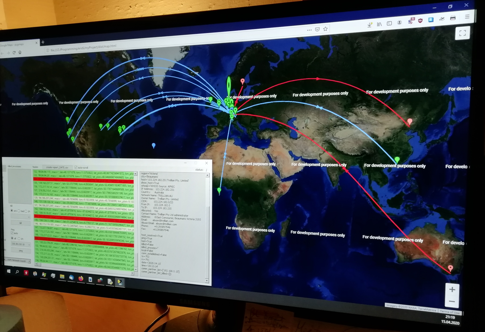
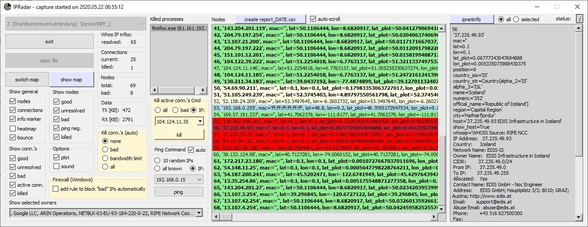

# IP Radar 2
Real-time detection and defense against malicious network activity and policy violations (exploits, port-scanners, advertising, telemetry, state surveillance, etc.)

https://www.codeproject.com/Articles/5269206/IP-Radar-2

## IP Radar 2 - Intrusion Detection and Prevention in Real Time Based, e.g., on Geographical Locations of Hosts

## IP Radar 2 – Main Window

## IP Radar (original SW) Video Playlist

[I'm an inline-style link with title](https://www.youtube.com/watch?v=EBGdES2b-zE&list=PLX24fhcibpHUbVMLRvzB5kC9kmXOvMXq_ "IP Radar (original SW) Video Playlist")
